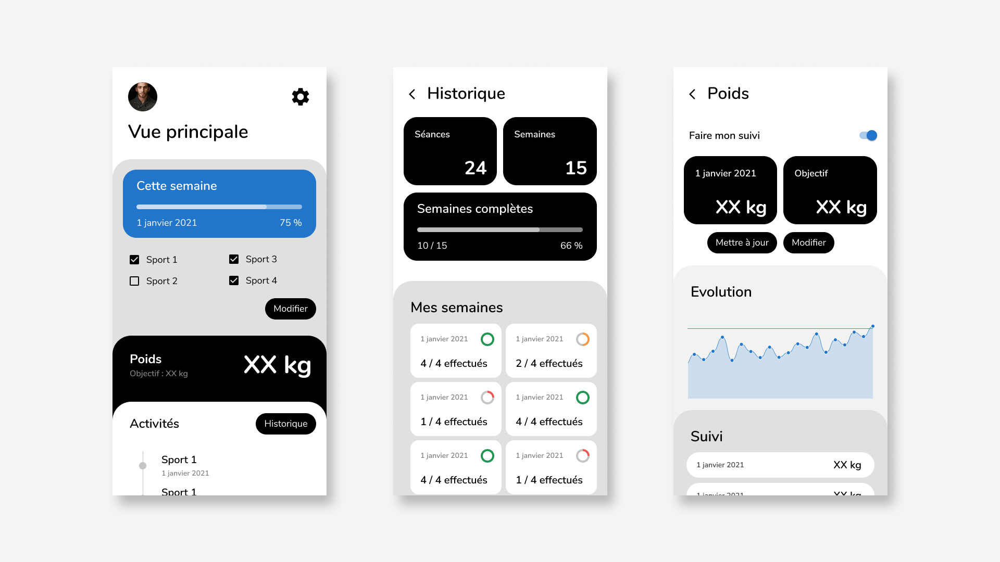

# AppSuper

# 📥 Usage

Une super app pour faire son suivi fitness.

:construction_worker: **Développement en cours…**

# 🔗 Liens
 * 🧟 [Build variants, buildtypes, productflavors](https://www.youtube.com/watch?v=OqdVrESAlx4)
 * 🗡️ [Injection de dépendances, partie 2 : Hilt et Dagger](https://youtu.be/lXbiQgnjiB0)
 * 📏 [Passage au ViewBinding](https://youtu.be/SDmrcuv6Dzg)
 * 🗃️ [Android ViewModel et Jetpack DataStore](https://youtu.be/3qo6iG2xaas)
 * 🎨 [Sketching & design de la future app mobile](https://youtu.be/rKivZ_22D8I)
 * 📏 [Nos premiers layouts](https://youtu.be/hghjTla7AcY)
 * 🌱 [Initialisation d'un projet Android](https://youtu.be/PYJCHY0zfm8)

# 🧰 Outils

## Pré-requis

* Gradle JDK Java 8
* Android SDK
* Android S (API 31)

## Langages, librairies & outils utilisés

* Kotlin
* AndroidX Navigation library
* AndroidX DataStore
* ViewModel
* Hilt
